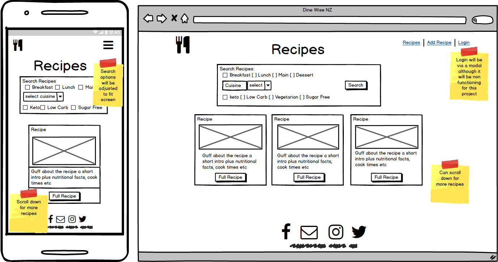
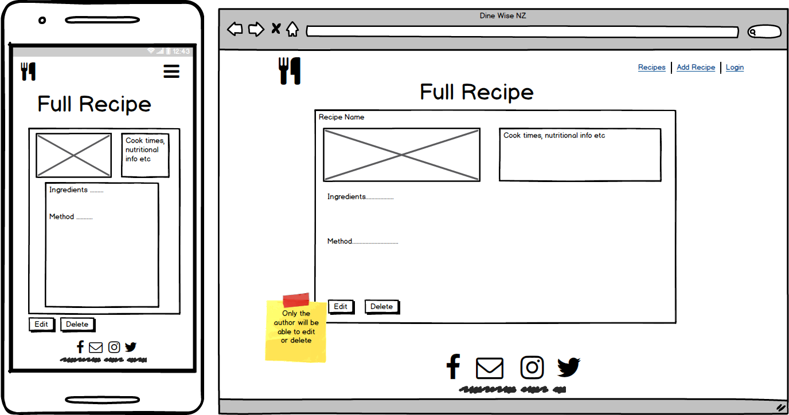
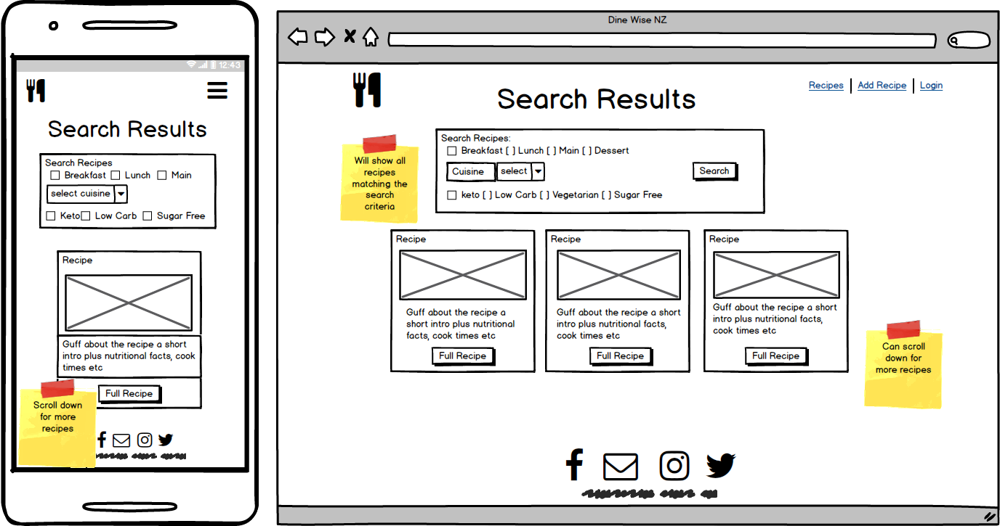
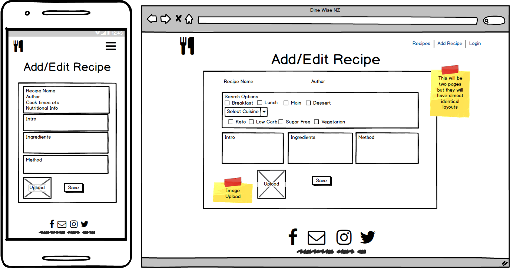

# Third Milestone Project by Holly Horwood

[Keto Kitchen Website](https://keto-kitchen-hollyci.herokuapp.com/)

---

## **Disclaimer:** 
This website was designed for educational purposes only for the Code Institute.  All best endeavours have been made to ensure all content has been obtained legally and all good practice guidelines for web development have been followed.

---

## **Motivation/Purpose**
This is my third milestone project for the Full Stack Software Development course through Code Institute.  I decided to create this website because I am a Type 1 Diabetic.  Myself and others with this condition often struggle to find good recipes and meal ideas that will not affect our blood glucose levels dramatically.  The only diet that has worked to help control this has been a low carb one so I wanted to make a site where other diabetics and followers of a low carb or keto lifestyle can easily find delicious and healthy recipes.

---

## **UX** 

### **_Strategy_**

**Research:**

 Keto and Low Carb are very similar, the main difference is the amount of carbs allowed daily, those eating Low Carb (Low Carbohydrate) will consume usually between 50gm to 100gm of carbs per day whereas a Keto (Ketogenic) diet is stricter limiting the daily intake to less than 50gm per day to maintain a state of ketosis in the body. 
 
 I consider myself quite knowledgable in this area as I have lived the low carb lifestyle for many years now. I also created my own low carb Facebook page for diabetics in New Zealand that at the time of writting this has over 1500 members and continues to grow almost daily.  Via my Facebook page I am able to discuss, learn, teach and share ideas, the page was a great inspiration for this project. I intend to eventually extend on this site to include restaurant recommendation for people looking for places to eat the offer low carb friendly options and I would also like to combine it with my previous project Keto Kitchen that shares recipes.  My facebook page alone has already changed so many lives for the better and I see this project as the start of another venture that will continue to help make diabetics lives easier and improve their health along the way.

**Audience:** 

 Anyone with diabetes or anyone following a low carb/keto lifestyle.

### **_Scope_**

**Features:**

**Home Page**

On a smaller device like a mobile phone all recipes will display vertically one by one and on larger devices they will show as a Bootstrap card-deck side by side 3 across at a time.  A search box has been placed at the top of the screen so it is easy for the user to find what they are looking for quickly.  A navigation bar offers a way to add, login or return to the recipes page easily.  The logo can be clicked for quick access to the home page and each recipe contains a clickable image and a full recipe button that will both take the user to the full screen recipe. 

Each recipe includes some basic information like an overview blurb about the recipe, image, cooking time, calories, carbs, ratings etc to help the user decide which recipe they would like to make. 

**Full Recipe Page**

The full recipe page goes into detail more.  It shows a larger image with the customer rating review widget below and a short blurb about the recipe.  To the right a breakdown can been seen of important information like the author, cook time, prep time and some key nutritional information relevant to those on a Low Carb diet. 

**Recipe Search Results Page**

Once the customer has select all required search results (they can select multiple checkboxes or leave blank) they will be redirected to the display results page.  Here they can view any recipes that match the criteria they have set when selecting search options.  The options they ticked or clicked on in the search area remain visible on the screen in the search container so the user can easily see what they had chosen to look up.

**Login**

_*Note - User authentication was not required for this project so the modal is not currently functioning, authentication will be added in the future including user registration._

The modal is intended to prevent users from altering recipes added by other users.  The modal (once functioning) will require the user to enter their email address and password before they are able to login.  Users will first need to register and logged in users will be able to add, edit or delete their own recipes.

**Add and Edit Recipe Pages**

These pages have an editable form with inputs for the recipe information.  Each time a new recipe is added a unique ID is created in the Mongo database which is then used to get the recipe from the database when required.

### **_Skeleton_**

**Wireframes:**

### **_Surface_** 

I designed this site using modern neutral colours.  Different variations of green are used throughout the site to represent healthy living.  There is a logo and favicon for easy identification of the site.  The navbar is transparent however on scroll it becomes white otherwise the user may get frustrated if they try to click on anything behind the navbar as it wont work.  The bootstrap card deck was used to make it easy to identify individual recipes and where applicable the search container is at the top of the screen so the user can easily search the site.

---

## **User Story**

As a user on the website I want the ability to easily find diet friendly recipes. 

**End user goal:** Find a recipe. 

**End business goal:** Make finding health concious recipes easier.

**Acceptance criteria:** Able to search the site for recipes matching my search criteria and get full instruction to follow so I can make the recipe.

---

## **Technologies Used**

**HTML & HTML5**
- HyperText Markup Language was used to create the structure        and layout of the index.html document. 
  
**CSS & CSS3**
- Used to add style to the web page.
  
**Bootstrap**
- Bootstrap was mainly used for positioning with its grid system to position containers. The card deck component was used to house each recipe.  Bootstrap was also used to create buttons, dropdowns and navbar.

**Javascript**
- Was used for image size restrictions and previews.

**JQuery**
- Used for the navbar colour change on scroll.

**MongoDB**
- Used to store all recipe input on a cloud based database.

**Pymongo**
- Used to interact with the MongoDB database from Python.

**Flask**
- Used to create Python routes and render or redirect them.

**Jinja**
- Used to create Python templates in HTML. 

**Unittest**
- Support with test automation.

**Heroku**
- Used in the deployment of this application.

**Ratings Widget**
- JS widget used for the star rating of each recipe.
https://rating-widget.com/

**Font Awesome**
- Used for icons on the page such as the footer links and search icon.

### **Other resources:**

**Stack Overflow**
- Image preview and file size check for add and edit pages. Code was altered but the original code was courtesy of nkon https://stackoverflow.com/questions/4459379/preview-an-image-before-it-is-uploaded

**YouTube**
- Navbar colour change on scroll - Code courtesy of System 22 I.T. Solutions https://www.youtube.com/watch?v=AM-GT_0Uu5w

**W3C Markup & CSS Validators**
- Used to check validity of HTML and CSS code used in this project.

**JSHint**
- Used to check all JS code for errors.

**MDN** 
- Main resource for research and help.

---

## **Testing**

**Running the Code**

- Click on the following link to access the live site at Github pages https://github.com/Holly-Horwood/keto_kitchen or for Heroku https://keto-kitchen-hollyci.herokuapp.com/

**Test Planning:**
  All tests were carried out manually by humans.  For the browser testing the users will interact with the map and click on all links and buttons and observe the results as well as viewing the site on different viewports. 

**Implementation:** 
 Users clicked on all buttons and links and used the map in all possible variations, users also changed screen sizes throughout the process to make sure the site was responsive.

**Results:** 
 All buttons and links behaved as expected, and map zoom levels worked as intended.

#### Browser Testing: #### 

**Chrome**

Passed.  No issues were found when used on Chrome.

**Opera**

Passed. No issues were found when used on Opera.

**Firefox**

Passed. No issues were found when used on Firefox.

**Edge**

Passed. No issues were found when used on Edge.

#### **External Testing**

**W3C Markup & CSS Valiadators**
- Used to check validity of HTML and CSS code used in this project, both returned no errors at completion.

**JSHint**
- Used to check all JS code for errors, none present on completion of this project.

#### **Issues:**

- DOC API is quite slow to run.

- DOC API key returned CORS error.  Contacted developer of API who worked on resolving the issue, once it was fixed from their end they contacted me and I was able to connect without anymore errors.

- Loader/Spinner not loading on all searches correctly.  This will be fixed in a future update.

- Marker clusterer was not clearing markers as intended on reload, this was fixed with some Javascript.

- Due to Google Maps using a Mercator style map it was quite difficult to get the zoom to work correctly for New Zealand. New Zealand is harder to scale than other countries due to it's very Southern location on the map which means that the latitude and longitude axes are distorted.

---

## **Future Updates**

- A functioning modal and user authentication including registration.

- Keyword search bar and more search options.

- User review section and change the current ratings widget to something better.

- Print recipe button.

- Connect to Pinterest.

- Pagination for all sized devices and scroll down arrow for smaller devices.

---

## **Deployment**

This project was created using Visual Studio Code.

### **Heroku**

- I created a new app in heroku called keto-kitchen-hollyci.
- In *add-ons* under the *resources* I typed *Postgres* and selected *Heroku Postgres* on the Hobby Free plan.  This created a new DATABASE_URL in the *config vars* under *settings*.  While in the *config vars* and while there I added my secret key.

### **Running The Code Locally:**

- Go to my repository https://github.com/Holly-Horwood/keto_kitchen
- Click on the clone or download button
- In the Clone with HTTPs section, click  to copy the clone URL for my repository.
- Open your environment terminal
- Type `git clone` into the command line and then paste my URL that you copied.
- Press enter and the clone will be created.

### **GitHub** ###

All coding was committed and pushed to my Github repository at:

https://github.com/Holly-Horwood/keto_kitchen

It was also published on Github pages at:

https://holly-horwood.github.io/second-milestone-project/

### **Deploying to Github Once Cloned and Edited** ###

- In your terminal type `git add .` to stage all pending updates
- Type `git commit -m "example massage"` add your own message explaining what you are committing.
- Type `git push -u origin master` to push to my repository

---

## **Credits**

**Content:**

All content written by Holly Horwood.

**Media:**

- DOC Location Map Api - Crown Copyright: Department of Conservation Te Papa Atawhai [2019].
- kea.jpg & cathedralcove.jpg both obtained from Flickers Creative Commons website.
- All other images supplied by Holly Horwood and Ryan Connor from our personal collection.
- Tent and Hut icons by icons8.com
- Favicon was generated using favicon.io
- gatadeoro for his post on Stack Exchange that helped with the geo.js file creation https://gis.stackexchange.com/questions/225065/converting-nztm-new-zealand-transverse-mercator-to-lat-long
- Google Maps Marker Clusterer care of the team at google maps https://github.com/googlemaps/v3-utility-library/tree/master/markerclusterer

**Acknowledgements:**

Thanks to Sebastian Immel my mentor for all of his help and patience.  Thanks also to the students and staff at Code Institute especially my tutors Nakita, Haley and Dick.

Thank you also to Mick and Julian at DOC for all of their help and awesome API.

Star ratings app from rating widget https://rating-widget.com/get/rating/javascript/#editor

MongoDB Schema
relational schema we are using nesting.  Diet and course are not likely to be edited by users, they are administratively designed data.  The other rational is that they are simple data as they have only one field and that is tyheir name.  However the recipe collection could be quite large so for the simple purpose of populating checkboxes or search and editing we store them in their own collectiona as well.

Google fonts: Kaushan Script